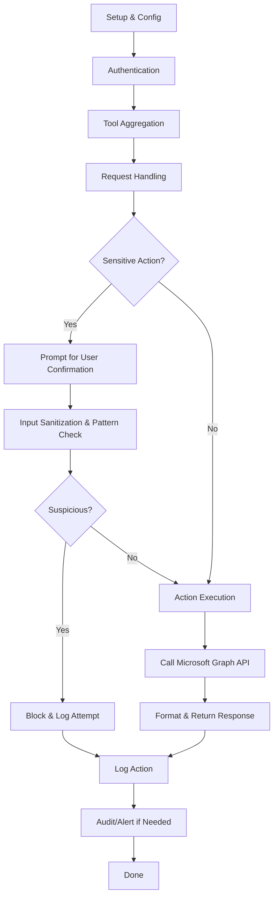

## Workflow Diagram (Mermaid)

# Modular Outlook MCP Server: Workflow Explainer

## Overview
This MCP (Model Context Protocol) server acts as a secure, modular bridge between Claude (or other MCP clients) and Microsoft Outlook, using the Microsoft Graph API. It enables AI agents to perform Outlook operations (email, calendar, rules, folders) in a controlled, auditable, and secure way.

---

## High-Level Workflow

1. **Setup & Configuration**
   - Register an Azure app and configure permissions (scopes) for Microsoft Graph API.
   - Set up environment variables (`.env`) with client credentials and desired scopes.
   - (Optional) Configure secure prompting and other security features.

2. **Authentication**
   - Start the OAuth server (`npm run auth-server`).
   - The client (e.g., Claude Desktop) requests authentication, receives an OAuth URL, and the user completes the flow in their browser.
   - Access tokens are securely stored for future API calls.

3. **Tool Aggregation**
   - The main server (`index.js`) loads all functional modules (email, calendar, folder, rules, etc.), each exporting a set of "tools" (handlers for specific actions).
   - These tools are registered with the MCP protocol implementation, making them available to the client.

4. **Request Handling**
   - The client (Claude or another MCP agent) sends a request to perform an action (e.g., send an email, create an event).
   - The server validates configuration, checks for required authentication, and (if `SECURE_PROMPT_MODE` is enabled) prompts for explicit user confirmation before sensitive actions.
   - Inputs are sanitized and checked for suspicious patterns to prevent prompt injection.

5. **Action Execution**
   - Upon confirmation, the relevant module handler makes a call to the Microsoft Graph API using the stored access token.
   - The response is formatted and returned to the client.
   - All sensitive actions and their arguments are logged, with alerts for repeated suspicious activity.

6. **Error Handling & Security**
   - If configuration or authentication is missing, the server fails closed and refuses to perform sensitive actions.
   - Errors and suspicious attempts are logged for audit and monitoring.

---

## Example: Sending an Email
1. Claude issues a `sendEmail` tool request with recipient, subject, and body.
2. The server checks config, authentication, and (if enabled) prompts the user for confirmation.
3. User confirms; the server sanitizes input and checks for suspicious patterns.
4. The email is sent via Microsoft Graph API.
5. The action and arguments are logged.

---

## Security Features
- **Explicit user consent** for all sensitive actions (enabled by default)
- **Input sanitization** and suspicious pattern detection
- **Configurable OAuth scopes** for least-privilege access
- **Fail-closed** on missing config or authentication
- **Comprehensive logging** and alerting for abuse attempts

---

## Extending the Workflow
- Add new modules/tools by following the modular pattern (see `calendar/`, `email/`, etc.)
- Register new tools in the main server entrypoint
- Use utility helpers for Graph API and OData query building

---

For more details, see the README, `config.js`, and module source files.
